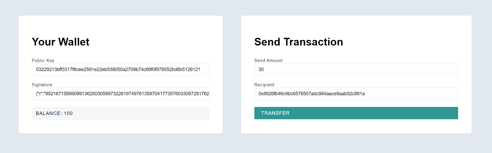

## ECDSA Node

This project is an example of using a client and server to facilitate transfer between different addresses. The focus of this project is to incorporate **Public & Private Key Cryptography** by using **Elliptic Curve Digital Signatures**, similar to how blockchain transactions work.

Although the system uses a single centralized server, users can transfer secure their transaction by only passing their Public Key and the Transaction Digital Signature to create a cryptography-based transaction, without having to use their Private Key. 

To create a transaction, user will sign a transaction using by passing their Private Key and the Transaction Message, combining the receiver's address and the amount of balance to be sent. After being signed, the user will pass the Transaction Signature and the Public Key to the server. The server will then verify, whether the transaction is valid.

 
### Client

The client folder contains a [react app](https://reactjs.org/) using [vite](https://vitejs.dev/). To get started, follow these steps:

1. Open up a terminal in the `/client` folder
2. Run `npm install` to install all the depedencies
3. Run `npm run dev` to start the application 
4. Now you should be able to visit the app at http://127.0.0.1:5173/

### Server

The server folder contains a node.js server using [express](https://expressjs.com/). To run the server, follow these steps:

1. Open a terminal within the `/server` folder 
2. Run `npm install` to install all the depedencies 
3. Run `node index` to start the server 

The application should connect to the default server port (3042) automatically! 

### Existing Users

`users.txt` is available in the `/server` folder, which consists of the 3 users having an existing balance in the system

### Generating New User

Run `node server/scripts/generate` to generate a new user and get the Private Key, Public Key, and the Account Address.

### Signing A Message

Run `node server/scripts/sign <PRIVATE_KEY> <DESTINATION_ADDRESS> <AMOUNT_TO_SENT>` to sign a transaction.
Use the returned Signature to deploy your transaction to the server.

### Deploying Transaction

Enter your **Public Key** and **Transaction Signature**. Then confirm the **Sent Balance Amount** and the **Destination Address**. 
Click the `Transfer` button to deploy the transaction.
